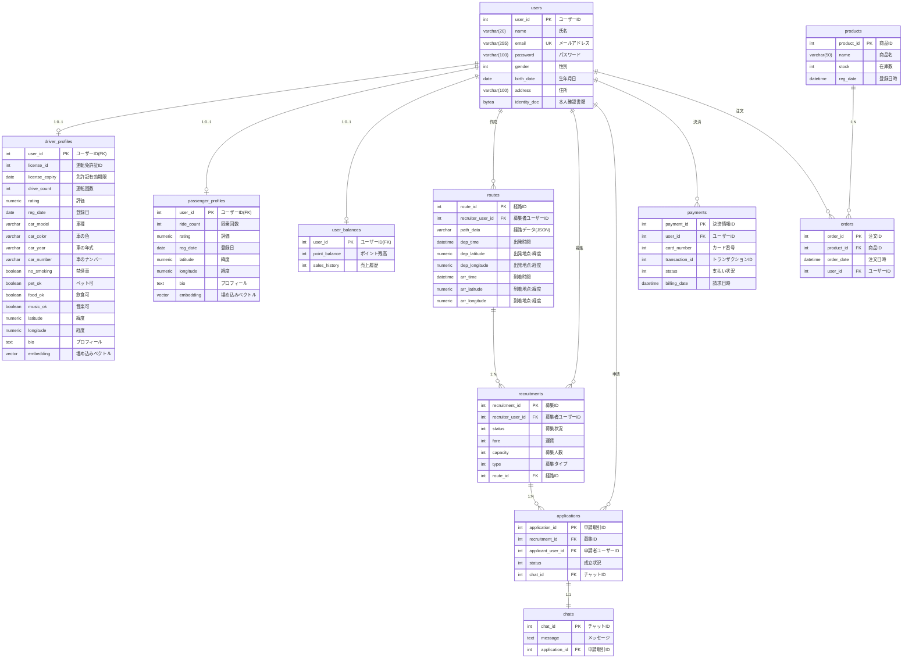

# データベース構成図

## ER図（Entity Relationship Diagram）



## テーブル一覧

### 1. ユーザー管理系
| テーブル名 | 説明 | 主キー |
|-----------|------|--------|
| `users` | ユーザー基本情報 | `user_id` |
| `driver_profiles` | 運転者プロフィール | `user_id` (FK) |
| `passenger_profiles` | 同乗者プロフィール | `user_id` (FK) |
| `user_balances` | ユーザー残高 | `user_id` (FK) |

### 2. 募集・マッチング系
| テーブル名 | 説明 | 主キー |
|-----------|------|--------|
| `routes` | 経路情報 | `route_id` |
| `recruitments` | 募集管理 | `recruitment_id` |
| `applications` | 申請取引 | `application_id` |
| `chats` | チャット | `chat_id` |

### 3. 決済・商品系
| テーブル名 | 説明 | 主キー |
|-----------|------|--------|
| `payments` | 決済情報 | `payment_id` |
| `orders` | 注文 | `order_id` |
| `products` | 商品 | `product_id` |

## リレーションシップの説明

### ユーザーとプロフィール
- 1人のユーザーは、運転者プロフィールと同乗者プロフィールのどちらか（または両方）を持つことができる
- `users` ← `driver_profiles` (1:0..1)
- `users` ← `passenger_profiles` (1:0..1)

### 募集フロー
1. ユーザーが経路を作成 (`routes`)
2. 経路に対して募集を作成 (`recruitments`)
3. 他のユーザーが募集に申請 (`applications`)
4. 申請に対してチャットが紐付く (`chats`)

```
users → routes → recruitments → applications → chats
  ↓                                ↑
  └────────────────────────────────┘
         (申請者として)
```

### 決済フロー
- ユーザーが決済情報を登録 (`payments`)
- ユーザーの残高を管理 (`user_balances`)

### 商品購入フロー
- 商品が存在 (`products`)
- ユーザーが注文 (`orders`)

## 特殊な型の説明

### 位置情報（緯度・経度）
| カラム | 型 | 説明 | 範囲 |
|--------|-----|------|------|
| `latitude` | `NUMERIC(10, 8)` | 緯度 | -90.0 ~ 90.0 |
| `longitude` | `NUMERIC(11, 8)` | 経度 | -180.0 ~ 180.0 |

**使用例:**
```python
# 東京タワーの位置
latitude = 35.65858154
longitude = 139.74543476
```

### AI・機械学習用
| 型 | 説明 | 使用箇所 |
|----|------|---------|
| `vector(384)` | 埋め込みベクトル | プロフィールの意味的検索用 |

## インデックス戦略

### 主キー（自動インデックス）
- すべてのテーブルで主キーに自動的にインデックスが作成される

### ユニークキー
- `users.email` - メールアドレスの重複を防ぐ

### 外部キー
- すべての外部キー列にインデックスが推奨される（JOIN性能向上）

### 推奨される追加インデックス
```sql
-- 検索頻度が高い列
CREATE INDEX idx_recruitments_status ON recruitments(status);
CREATE INDEX idx_applications_status ON applications(status);
CREATE INDEX idx_routes_dep_time ON routes(dep_time);

-- 位置情報検索用（緯度・経度の複合インデックス）
CREATE INDEX idx_driver_location ON driver_profiles(latitude, longitude);
CREATE INDEX idx_passenger_location ON passenger_profiles(latitude, longitude);
CREATE INDEX idx_routes_dep_location ON routes(dep_latitude, dep_longitude);
CREATE INDEX idx_routes_arr_location ON routes(arr_latitude, arr_longitude);

-- ベクトル検索用（IVFFlatインデックス）
CREATE INDEX idx_driver_embedding ON driver_profiles 
  USING ivfflat (embedding vector_cosine_ops) WITH (lists = 100);
CREATE INDEX idx_passenger_embedding ON passenger_profiles 
  USING ivfflat (embedding vector_cosine_ops) WITH (lists = 100);
```

## データフロー例

### 例1: 運転者が同乗者を募集
```
1. 運転者ユーザーがログイン (users)
2. 運転者プロフィール確認 (driver_profiles)
3. 経路を作成 (routes)
4. 募集を作成 (recruitments, type=運転者募集)
5. 同乗者が検索・申請 (applications)
6. チャットでやり取り (chats)
7. 決済 (payments)
```

### 例2: 同乗者が運転者を募集
```
1. 同乗者ユーザーがログイン (users)
2. 同乗者プロフィール確認 (passenger_profiles)
3. 経路を作成 (routes)
4. 募集を作成 (recruitments, type=同乗者募集)
5. 運転者が検索・申請 (applications)
6. チャットでやり取り (chats)
7. 決済 (payments)
```

## 制約と整合性

### NOT NULL制約
- 必須項目には`nullable=False`を設定
- ユーザーの基本情報、決済の重要情報など

### 外部キー制約
- すべての外部キーに`ForeignKey`を設定
- 参照整合性を保証

### デフォルト値
- `drive_count`, `ride_count`: 0
- `rating`: 0.0
- `point_balance`, `sales_history`: 0
- `stock`: 0

### チェック制約（推奨）
```sql
-- 評価は0.0〜5.0の範囲
ALTER TABLE driver_profiles ADD CONSTRAINT check_driver_rating 
  CHECK (rating >= 0.0 AND rating <= 5.0);

ALTER TABLE passenger_profiles ADD CONSTRAINT check_passenger_rating 
  CHECK (rating >= 0.0 AND rating <= 5.0);

-- 運賃は正の値
ALTER TABLE recruitments ADD CONSTRAINT check_fare 
  CHECK (fare >= 0);

-- 募集人数は正の値
ALTER TABLE recruitments ADD CONSTRAINT check_capacity 
  CHECK (capacity > 0);
```

## スケーラビリティの考慮

### パーティショニング（将来的な最適化）
大量データが予想されるテーブル:
- `applications` - 申請日時でパーティション
- `chats` - 作成日時でパーティション
- `payments` - 請求日時でパーティション

### キャッシュ戦略
- ユーザープロフィール: Redis等でキャッシュ
- 募集情報: TTL付きキャッシュ
- 商品在庫: リアルタイム性が必要

---

**作成日**: 2024年12月24日  
**バージョン**: 1.0  
**対応モデル**: `modelDB.py`

